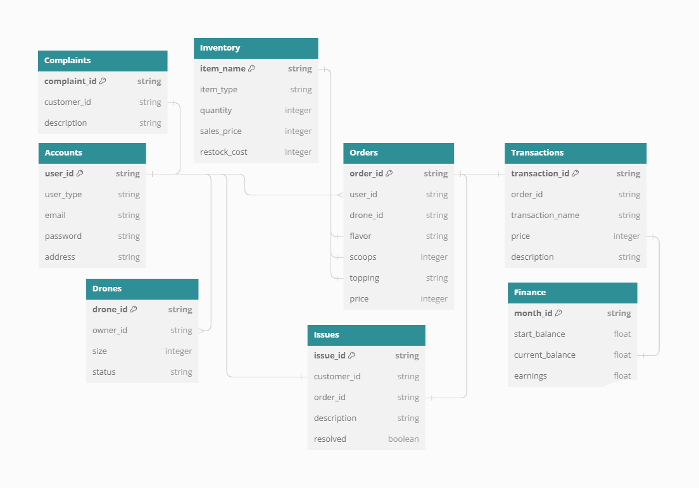

# High-Level Design Document

## Platform

Drone Cones will be a web application.

## Architecture

Client/Server Architecture

## Programming Languages, Libraries, and Frameworks

Django - Python, Vue.js - JavaScript

## Systems

The application will be split into the following 6 main systems.

### Account System

The account system is responsible for user accounts and logins. There are three types of user accounts:

* Customer
* Drone Owner
* Admin (Manager) 

We will use Django's PBKDF2 flexible password storage system to manage sensitive account information.

#### User Data

User account data consists of a combination of data obtained by the user at
the creation of the account and data collected through the user's use of the app.
This data consists *at least* the following (based on the user's role):

**Customer**
* Email
* Password
* Delivery address

**Drone Owner**
* Email
* Password
* Delivery address (optional - if the user wishes to use the customer privileges of the account)

**Admin**
* Email
* Password
* Delivery address (optional - if the user wishes to use the customer privileges of the account)

#### User Permissions

Once a user is registered for an account, the user will have different privileges granted to them based on account type.

**Customer**
* Log in to account
* View menu 
* Place an order
* View active order status
* View order history

**Drone Owner**
* Log in to account
* View drones registered under account
* Temporarily or permanently remove drone from service
* View payments
* View drone activity
* All permissions of a customer

**Admin**
* Log in to account
* View active and past orders
    * As well as a summary of past orders
* Check and update inventory
* View customer feedback
* View drone and drone owner info
* View incoming and outgoing payments
    * As well as a summary of financial activity
* Ban other users
* All permissions of a customer
* All permissions of a drone owner

#### Sub-Systems

The account system can be broken down into the following sub-systems:

* **Account Table** - 
This is a table of all user accounts made. It is where admin operations regarding account data takes place (i.e. banning an account, making changes to password, etc.). The table will contain the account type and required information for the relevant user type. Columns for data irrelevant to the user role will contain `NULL`.
* **Login Page** - 
This is where users will login into their accounts using their account credentials.
* **Registration Page** - 
This is where new user accounts will be made.
* **Account Page** - 
This is a page that will display user account info, as well as provide tools to users to modify info such as password and address.
* **Forgot Username/Password Page** - 
This is where users can contact customer support to help unlock their account.  For this project, an email system to send user credentials will not be made.
* **Authentication** - 
This will deal with security aspects of the user account logins in the background.

### Ordering System

The ordering system defines how a user sees, selects and sends an order to Drone Cones, and how the business stores past orders and tracks current ones.

#### User View

The user will see a menu that displays what is available in the inventory. The user selects how they would like their ice cream, including options for toppings, flavor, and size. They then proceed to checkout to review their order.

#### Order Information

The order information that is stored for a registered user includes the contents (flavors, size, toppings, etc.), User ID, price, and what drone is responsible for the delivery.

#### Order Processing and Delivery

The order information is first sent in its entirety to the order processing system. This system is responsible for:

1. Communicating to the Account System (the customer) the current status of orders
2. Informing the Inventory Management System which ingredients were used
3. Communicating orders to the Drone System for pick up
4. Calculating the ETA and returning it to the user
5. Storing orders in the database as the **Order Table**
  
### Inventory Management System

The inventory management system is responsible for tracking and updating the inventory.

An inventory item can be defined as follows:

* Item Name
* Item Type
* Current Quantity
* Sales Price per Unit
* Restock Cost per Unit

There are three types of inventory items:

* Containers (Cones, bowls, etc.)
* Ice Cream (Flavors)
* Toppings (Sprinkles, nuts, etc.)

**Considerations**: Units for each item type, as well as units in context of menu items need to be well-defined (i.e. Liters of ice cream vs. a "scoop" of ice cream needs to be defined).

The inventory system can be broken down into the following subsystems:

* **Inventory Table**: The database will have a table that holds all the inventory data and has functionality to query and update the inventory (restocking, depleting inventory for orders, etc.).  When inventory is restocked, the finance system will have money depleted from finance database and update the transactions database.
* **Inventory Report Generator**: This allows admins to see a report of the current state of the inventory.

### Finance System

The finance system is responsible for handling financial transactions and providing tools for admins to perform financial operations (generating reports, making lease payments, refunding customers, etc.)

A transaction can be defined as follows:

* Transaction ID
* Amount (in dollars)
* Transaction Name
* Description

An important financial transaction for Drone Cones is lease payments to drone owners who lease their drones.  A lease consists of the following:

* Drone Size Class - The size of the drone (large, medium, small)
* Monthly Payment Rate - How much the drone owner will get paid per month.  The monthly rate is fixed.  The rate is determined by the size of the drone.

The finance system can be broken down into the following sub-systems:

* **Transaction Table** - This table of the database contains all transactions that occurred.
* **Finance Table** - This table of the database holds current state of the business finance.  It also has operations to add or deplete cash.  The database might hold the following info:

    * Current Balance - How much money the company currently has.
    * Start of Month Balance - How much money the company had a start of current month.
    * Earnings/Deficit of Month Amount - How much money earned or lost for the current month.

* **Finance Report Generator** - This will allow admins to have a report of earnings, costs, and other relevant financial info.

* **Lease Payment System** - This is a tool that allows admins to make lease payments to drone owners.  This should query the **Drone Table** (under Drone System) to get a list of leases currently active.  The finance and transaction tables should be updated as needed.

* **Customer Transaction Modifcation System** - This is a tool for admins to issue refunds or modify a customer transaction (i.e. applying a discount that may have been forgotten).  This also queries the **Order Issues Table** from the customer support system for descriptions of the order issues to be resolved.

**Considerations**

* Transactions must account for tax.  Use 3% tax rate for all food itmes, which is in accordance to Utah State Tax Commission.

* Price of ice cream scoops are all the same,  $1 per scoop.

### Drone System

The drone system is responsible for the following:

1. Assigning orders received from the Ordering System
2. Registering and deactivating drones from the **Drone Table**
3. Delivering orders
4. Updating order status in the **Order Table**

A drone can be defined as follows:
* Drone ID
* Drone owner ID (ID of the owner, stored in the **Account Table**)
* Size (ranging from small, medium, or large)
* Status (Busy, Available, Deactivated)

**Considerations**:
* A drone owner is also a customer in the system
* A drone owner can have virtually infinite drones registered, while each drone only has one owner
* Drone sizes will be determined by the amount of "scoops" they can carry
    * Small drones will carry 1 scoop
    * Medium drones will carry 2 scoops
    * Large drones will carry 3 or more scoops
* Since this is a prototype and we aren't actually delivering ice cream, "delivering" orders will actually just set a short timer
* Drone owners will be compensated based on the amount of time their drone is leased (as opposed to a per delivery basis)

Drone owners will be able to add or remove drones from the **Drone Table** if they wish to lease or unlease their drones.

**Drone Report Generator** - Administrators will be able to generate a report showing all drone data.

### Customer Support System

The customer support system is responsible for handling order issues and customer complaints.

Order issues deal with problems with an order (overcharging the customer, forgetting to apply discounts, refunds, etc). An order issue can be defined as follows:

* Order issue ID
* Customer info (provided by customer account or manual input for non-account holders)
* Order ID
* Description

A customer complaint can be defined as follows:

* Customer complaint ID
* Customer info (provided by customer account or manual input for non-account holders)
* Description

The customer support system can be broken down into the following sub-systems:

* **Order Issue Table** - This holds a queue of customer issues to be resolved.  Customers can add order issues via the customer support page, and admins can remove order issues when resolved via the Customer Transaction Modifcation System in the finance database.
* **Customer Complaint Table** - This simply holds all the customer complaints.
* **Customer Support Report Generator** - This will allow admins to receive a report of customer complaints and pending order issues.
* **Customer Support Page** - This is where a customer can enter in an order issue or customer complaint.  This consists of inputting whether the problem is order-related or complaint-related, customer info and a text description of the order issue or complaint.

### Database
With all the systems defined, the database will contain the following 8 tables:
* Account Table
* Inventory Table
* Order Table
* Transaction Table
* Finance Table
* Drone Table
* Order Issue Table
* Customer Complaint Table

Below is a UML diagram for how he tables could look and interact with each other inside the database. Because this is the high level design document, the data is still expected to change, along with the variable types.
