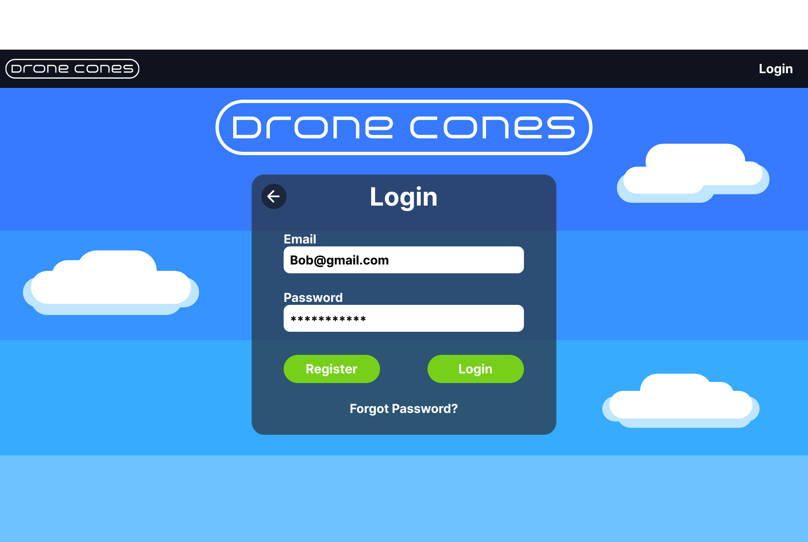

# Low Level Frontend Design

## UI Diagrams Figma Project Link
https://www.figma.com/file/kuxGFMhTcyI4Y4n39xwAdq/DroneCones_UX_Blueprint?type=design&node-id=0%3A1&mode=design&t=ioyr94quhipTfDVW-1

## Account/Main Pages

### Home

The user can:

* Move to the login page
* Move to the menu page
* Move to the page to create a customer account
* Move to the page to create a drone owner account
* Move to the page to apply to create an admin account

Requests made to the backend:

* n/a

### Login

The user can:

* Enter their login information and attempt to log in
    * If login is successful, the user is moved to the dashboard page
* Move to the page to create an account
* Move to the customer support page

Requests made to the backend:

* Verify login information
    * And get user ID / role (permissions)

### Dashboard

The user can (depending on the permissions of their role):

* Access admin tools
    * Move to the financial records page
    * Move to the manage payments page
    * Move to the manage inventory page
    * Move to the manage accounts page
    * Move to the manage menu page
* Access drone owner tools
    * Move to the drone registration page
    * Move to the payments page
    * Move to the drone activity page
* Access customer options
    * Move to the menu page
    * Move to the order history page

No requests made to the backend from the initial dashboard.

## Customer Pages

### View Menu & Select Items

The user can:

* Select a suggested cone
* Create their own cone
* Add a cone to their cart
* Move to the cart page
* Return to the dashboard page

Requests made to the backend:

* Get available cones, ice cream flavors, and toppings
    * As well as their prices

### View Cart & Check Out

The user can:

* View their cart
* Edit/remove items in their cart
* Return to the menu page
* Enter location information
* Place their order (which moves them to the order tracking page)

Requests made to the backend:

* Place a new order

### Track Order

The user can:

* View how far away their order is from arrival
* Be automatically moved to the order arrived page when the order completes

Requests made to the backend:

* Periodically checks to see the status of the order

### Order Arrived

The user can:

* Return to the dashboard page

No requests are made to the backend.

### Order History

The user can:

* View their past orders
* Select one to reorder (sends user to the checkout page)
* Return to the dashboard

## Drone Owner Pages
### Menu
The drone owner will have options to move between the registration, activity, and payments pages.
### Drone Registration
The drone owner can:

* Register a new drone
* Temporarily remove a drone from service
* Permanently remove a drone from service

Requests made to the backend:

* Query drone data
    * Get drone ID, name
* Change drone data
    * Change drone status

### Drone Activity
The drone owner can:

* View data for each drone registered

Requests made to the backend:

* Query drone data
    * Get deliveries
    * Get status
### Earnings

The drone owner can:

* View their current balance

Requests made to the backend:

* Query user
* Query orders

## Admin Pages

### Manage Accounts

The admin user can:

* View list of all registered accounts.
* Modify the account type via dropdown menu.
* Modify whether the account is active or banned.

Requests made to the backend:

* Query accounts database to generate a list of accounts consisting of:
  * User ID
  * Email
  * Account Type
  * Account Status
* Given a specific user account:
  * Request to change Account Type in database.
  * Request to change Account Status in database.

### Manage Inventory

The admin user can:

* View list of all inventory items.
* Restock items.

Requests made to the backend:

* Query inventory database to generate a list of inventory items consisting of:
  * Item ID
  * Item Name
  * Item Cost per Unit
  * Quantity
* Given a specific item:
  * Request to modify quantity of an item in inventory database.
  * Request to modify balance in finance database.
  * Request to modify current month profit/deficit.
  * Request to add new transaction corresponding to restock action.

* Stock Status is *dervied* from whether or not quantity is or is not 0.

### Manage Lease Payments

The admin user can:

* View list of active leases.
* Make lease payments to selected unpaid leases.

Requests made to the backend:

* Query drones database to generate a list of leases consist of:
  * Drone ID
  * Drone Owner ID
  * Drone Size Class
  * Amount Due
* Given a specific drone ID:
  * Request to modify amount due data point corresponding to the drone ID.
  * Request to modify balance in finance database.
  * Request to modify current month profit/deficit.
  * Request to add new transaction corresponding to lease payment action.
  
* Payment status is *dervied* from whether or not amount due is or is not 0.

### Financial Records

The admin user can:

* See current balance.
* See current earnings for the month.
* See a list of all transactions, arranged from most recent to lease recent.
* Generate a finance report (printable document or PDF).

Requests made to the backend:

* Query finance database to generate:
  * Current Balance
  * Current Month Starting Profit
    * Recorded at the start of each month.
  * Current Month Profit/Deficit
    * Calculated by summing together all transactions from start of month to current date.
  * A list of transactions consisting of:
    * Transaction ID
    * Transaction Type
    * Description
    * Amount

### Manage Menu

The admin user can:

* See list of menu items.
* Add/Remove menu items.
* Edit the price of menu itmes.

Requests made to the backend:

* Query inventory database and menu database to generate list of menu items consisting of:
  * Item ID (from inventory database)
  * Item Name (from inventory database)
  * Item Type (from inventory database)
  * Sales Price (from menu database)
* Given an item ID to remove:
  * Request deletion of menu item in menu item database.
  * Request deletion of corresponding inventory item.
* Given an item ID to edit:
  * Request modification of menu item sales price.
* Given an item name, item tpye, cost per unit, and sales price,
  * Request insertion of corresponding inventory item in inventory database.
  * Request insertion of menu item in menu item database.

* Stock Status is *dervied* from whether or not quantity (from inventory database) is or is not 0.

## UI Diagrams

