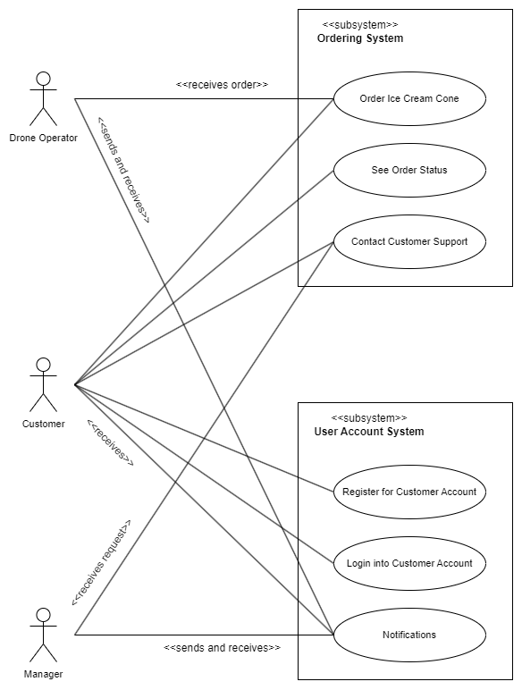
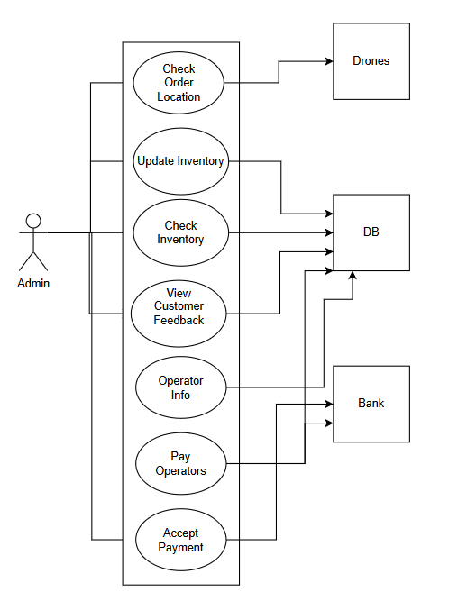
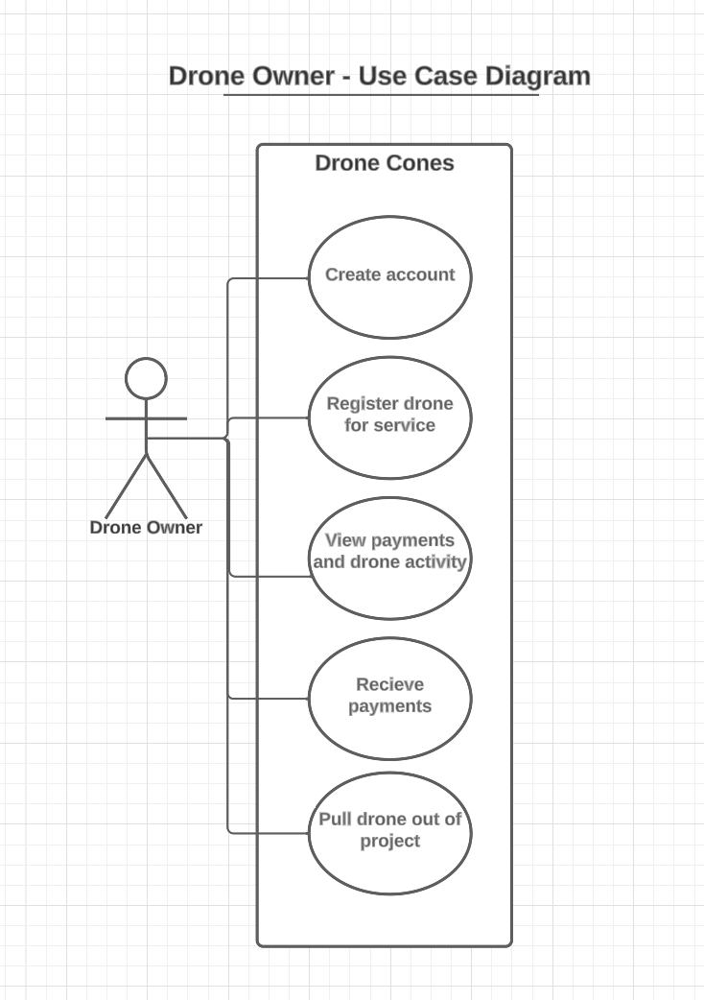

# Requirements Document

## Problem Description

Drone Cones aims to provide a service that can allow a customer to order ice cream products at their specified location and have them delivered via drone delivery.  This will require systems to facilitate customer, drone operator, and manager interactions.

## Solution Description

To achieve these goals, our software will provide the following:

1. An ordering system to allow customers to view menu items, add menu items into an order, pay for the order, and track the status of the order as it is being delivered.

2. An account system to store necessary data for customers, drone operators, and admins to allow notifications to be sent to account holders.

3. Administrative tools to allow management of menu inventory, perform customer support operations, perform financial operations and generate reports, and see drone status and leasing reports.

4. Drone operator tools to receive and process pending orders, register and unregister drones for lease, see earnings, and notify customers of when orders have arrived.  

## Customer User Stories

* As a customer, I want to order ice cream at my current location so I can obtain ice cream via drone delivery.
  
* As a customer, I expect to be able to contact customer support in order to resolve issues with my order.
  
* As a customer, I want to be able to track my current order to know when it will arrive.
  
* As a customer, I want to register for a customer account in order to receive sales promotions and other benefits.
  
* As a customer, I want to login to my customer account in order to check information pertaining to me, such as order history or current rewards points.
  
* As a customer, I expect to receive notifications from Drone Cones in order to know when orders arrive or if any sales promotions are occurring.

## Customer Use Cases

## Admin User Stories

* The admin wants to track the drones so that they can give an accurate ETA to customers.
  
* The admin wants to see and set stock levels so they can ensure ice cream is always on hand.
  
* The admin wants to see stats on how many orders they get so that they can know if the business is gonna go out of business.
  
* The admin wants to know the number of drone operators so they can know if they need to get more.
  
* The admin wants a simple dashboard that shows critical information so that they can handle urgent issues and not waste time searching.

## Admin Use Cases

## Drone Operator User Stories

* As a drone-owner, I want to be able to register a drone/register new drones.
  
* As a drone-owner (who likes to use my drone), I want to be able to pull my drone out of the project without needing excessive notice so I can have my drone back.
  
* As a drone-owner I want to see stats on my drone’s deliveries and location.
  
* As a business-oriented drone-owner, I want to be able to clearly see how much money I would make before committing to the project so I can make an informed decision.

* As a drone owner I want to see how much money I’ve made.

## Drone Operator Use Cases

## Drone Owner Data

* Username 
* Password 
* Email 
* Phone Number 
* Leassor ID
  
## Drone Data

* Status 
* Size
* Drone ID
  
## Other Data

* Order Queue
* Leased Drone List – List of leased drones, each item being a drone data item.  
