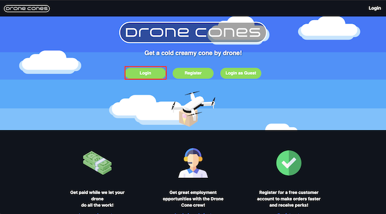
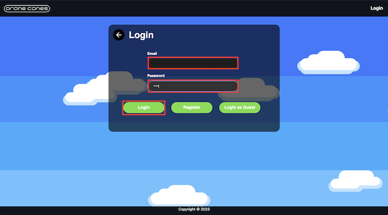
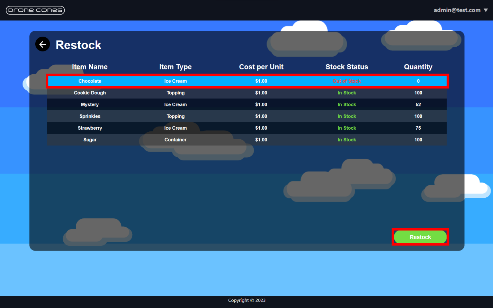

 # User Manual

## As a manager check on inventory and restock items
1. Click **Login**
    
    - Username: admin@test.com
    - Password: 1234
    
2. The panel on the left has two options 
    - Click admin tools
    
3. Now navigate to Manage Inventory
    - There should now be a list of items that are currently available
    - Click on the **Strawberry** item to highlight it
    - Now click the restock button
    
4. Enter an amount in the input box to restock
    - Now click restock
    
    

## As a manager run the revenue report to see if the business is profitable
1. Click **Login**
    - Username: admin@test.com
    - Password: 1234
2. The panel on the left has three options 
    - Click admin tools
3. Navigate to financial records
    - Review Financials 
4. Generate the report

## As a guest place an order when one or more items are out of stock
1. Click **Login**
    - Username: customer@test.com
    - Password: 1234
2. Click the main panel labeled **Place Order**
3. There is a featured section and a create your own section
    - We will be using the create your own section
    - On the panel select 2 scoops
    - Select peanut butter ice cream for one of the scoops
    - Choose any other toppings and add it to your cone
    - Once finished click **Add to Cart**
    - There should now be an error saying that peanut butter ice cream is **Out of Stock**

## As a customer make a new customer account and make an order when one or more items are out of stock
1. Click **Register**
    - **Email**: *test@test.com*
    - **Password**: *1234*
    - **Confirm Password**: *1234*
    - **Address**: *1234 Test St.*
    - **City**: *Logan*
    - **State**: *UT*
    - **Zip Code**: *84321*
    - **Account Type**: *Customer*
2. Click the main panel labeled **Place Order**
3. There is a featured section and a create your own section
    - We will be using the create your own section
    - On the panel select 2 scoops
    - Select peanut butter ice cream for one of the scoops
    - Choose any other toppings and add it to your cone
    - Once finished click **Add to Cart**
    - There should now be an error saying that peanut butter ice cream is **Out of Stock**

## As a customer review previous orders (this can be a pre-populated account)
1. Click **Login**
    - Username: customer@test.com
    - Password: 1234
2. Click the panel under the main panel labeled **Order History**
3. View your Order History

## As a drone operator create a new drone operator account and register your drone for service
1. Click **Login**
    - Username: drone@test.com
    - Password: 1234
2. The panel on the left has three options 
    - Click manage leased drone
3. Click the Drone registration panel to register a new drone
4. On this page you can see all of your registered drones and their current status'
    - On the bottom left of the page click the **Register New Drone** button 
5. Register your new drone
    - **Name**: *Namehere*
    - **Size**: *Select any size*

## As a drone operator review how many hours my drone(s) worked and how much $$$ I earned
1. Click **Login**
    - Username: drone@test.com
    - Password: 1234
2. The panel on the left has three options 
    - Click manage leased drone
3. Click the **Drone Activity** panel
    - Here you can monitor all of your registered drone's activities
    - Use the back button on the top left of the panel to navigate to the previous page
4. Click the **Earnings** panel
    - Here you can view the earnings you've made with each drone helping you determine the cost effectivness of your venture
