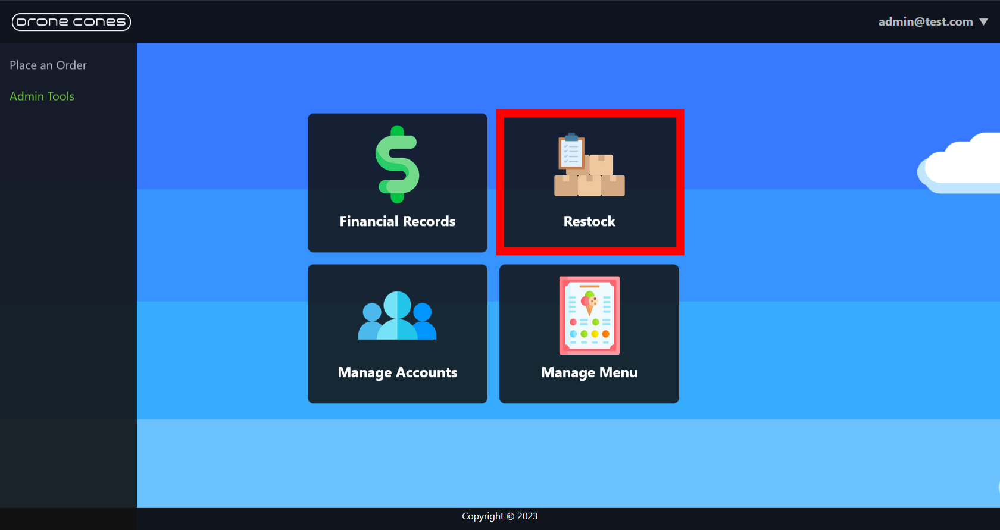
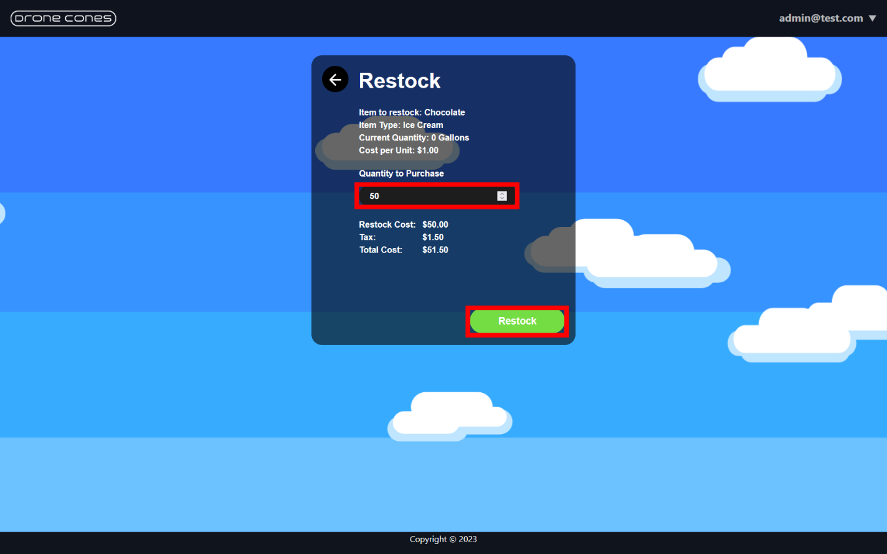
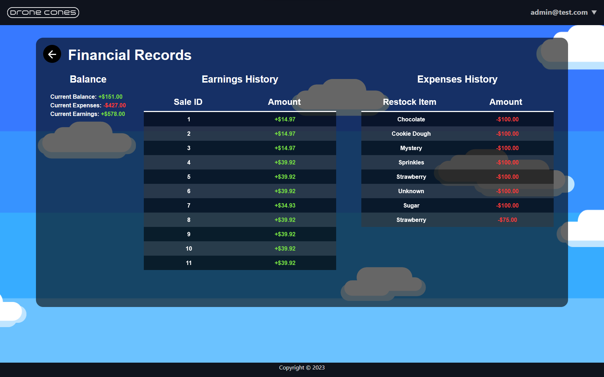
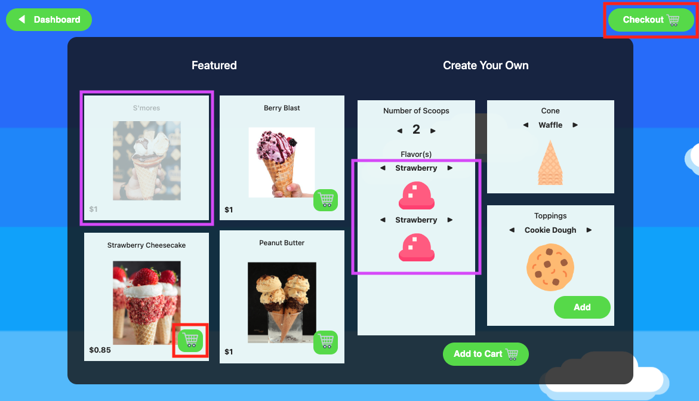
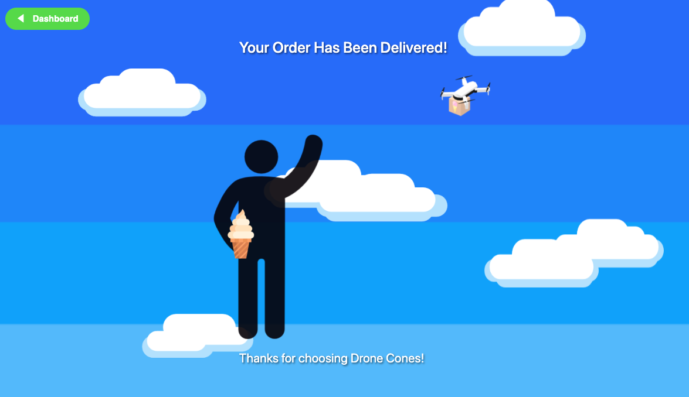
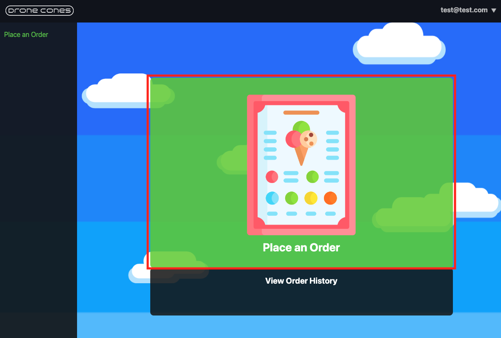

 # User Manual

## As a manager check on inventory and restock items
1. In homepage, click **Login** and enter following credentials on Login page:
    - **Username:** admin@test.com
    - **Password:** 1234

    Press the **Login** button when ready. 
    
    

2. Upon successful login, the panel on the left has two options. Click **Admin Tools**. 
  
    
1. Now click **Restock**. 
    

1. Click on an entry to select it (i.e.**Chocolate**).  Then, click the **Restock** button below the item table. 
    
1. Enter the quantity to purchase in the provided input.  Click on the **Restock** button when ready.  
    

1. Click the **Back** icon on upper left corner to return to dashboard. 
    

## As a manager run the revenue report to see if the business is profitable
1. Click **Login** and enter following credentials on Login page:
    - **Username:** admin@test.com
    - **Password:** 1234
  
    Press the **Login** button when ready. 
    
    
1. Upon successful login, the panel on the left has two options. Click **Admin Tools**. 
  

1. Now click **Financial Records**. 

    

1. You will see the generated financial report. 

1. Click the **Back** icon on upper left corner to return to dashboard. 
    

## As a guest place an order when one or more items are out of stock
1. Click **Login as Guest**
    - 
2. Click the main panel labeled **Place Order**
    - 
3. There is a featured section and a create your own section
    - 
    * In this example, chocolate ice cream is out of stock. 
   Notice that the featured S'mores cone (which includes chocolate ice cream)
   is unavailable. Chocolate ice cream is also not available to be selected in the CYO section.
4. Select an available item to add to the cart and click the Checkout button in the upper right of the screen.
5. Enter your desired delivery address in the box and click the Purchase & Place Order button. Your saved card will be automatically charged.
   - 
6. View the progress of the drone delivering your order.
   - 
7. Enjoy your cone!
   - 

## As a customer make a new customer account and make an order when one or more items are out of stock
1. Click **Register**
    - **Email**: *test@test.com*
    - **Password**: *1234*
    - **Confirm Password**: *1234*
    - **Address**: *1234 Test St.*
    - **City**: *Logan*
    - **State**: *UT*
    - **Zip Code**: *84321*
    - **Account Type**: *Customer*

   - 
   - 
2. Click the main panel labeled **Place Order**
   - 
3. There is a featured section and a create your own section
   - 
    * In this example, chocolate ice cream is out of stock.
      Notice that the featured S'mores cone (which includes chocolate ice cream)
      is unavailable. Chocolate ice cream is also not available to be selected in the CYO section.
4. Select an available item to add to the cart and click the **Checkout** button in the upper right of the screen.
5. Enter your desired delivery address in the box and click the **Purchase & Place Order** button. Your saved card will be automatically charged.
   - 
6. View the progress of the drone delivering your order.
   - 
7. Enjoy your cone!
   - 

## As a customer review previous orders (this can be a pre-populated account)
1. Click **Login**
    - Username: customer@test.com
    - Password: 1234
    - 
    - 
2. Click the panel under the main panel labeled **View Order History**
   - 
3. View your Order History
   - 
   * To reorder an item, click the corresponding **Add to Cart** button,
   then select the **Checkout** button on the upper right.

## As a drone operator create a new drone operator account and register your drone for service
1. Click **Login**
    - Username: drone@test.com
    - Password: 1234
    - 
    - 
2. The panel on the left has three options 
    - Click manage leased drone
3. Click the Drone registration panel to register a new drone
4. On this page you can see all of your registered drones and their current status'
    - On the bottom left of the page click the **Register New Drone** button 
5. Register your new drone
    - **Name**: *Namehere*
    - **Size**: *Select any size*

## As a drone operator review how many hours my drone(s) worked and how much $$$ I earned
1. Click **Login**
    - Username: drone@test.com
    - Password: 1234
    - 
    - 
2. The panel on the left has three options 
    - Click manage leased drone
3. Click the **Drone Activity** panel
    - Here you can monitor all of your registered drone's activities
    - Use the back button on the top left of the panel to navigate to the previous page
4. Click the **Earnings** panel
    - Here you can view the earnings you've made with each drone helping you determine the cost effectivness of your venture
